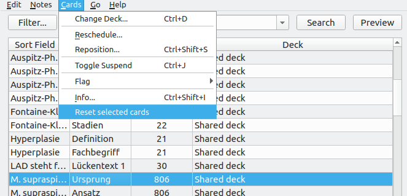
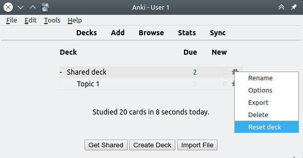

## Reset Card Scheduling Add-on for Anki

[Anki](https://apps.ankiweb.net/) add-on that allows you to reset the scheduling information / progress on select cards. Fork of Jeff Baitis' [anki-reset-card-scheduling](https://github.com/baitisj/anki-reset-card-scheduling) with support for Anki 2.1 and other smaller tweaks.

### Table of Contents

<!-- MarkdownTOC -->

- [Reset Card Scheduling Add-on for Anki](#reset-card-scheduling-add-on-for-anki)
    - [Table of Contents](#table-of-contents)
    - [Screenshots](#screenshots)
    - [Installation](#installation)
    - [Documentation](#documentation)
    - [License and Credits](#license-and-credits)

<!-- /MarkdownTOC -->

### Screenshots

### Installation

**AnkiWeb**

[Link to the add-on on AnkiWeb](https://ankiweb.net/shared/info/not_available_yet)

**Manual installation**

*Anki 2.0*

1. Go to *Tools* → *Add-ons* → *Open add-ons folder*
2. Find and delete `Reset Card Scheduling.py` and `reset_card_scheduling` if they already exist
3. Download and extract the latest Anki 2.0 add-on release from the [releases tab](https://github.com/Glutanimate/reset-card-scheduling/releases)
4. Move `Reset Card Scheduling.py` and `reset_card_scheduling` into the add-ons folder
5. Restart Anki

*Anki 2.1*

1. Go to *Tools* → *Add-ons* → *Open add-ons folder*
2. See if the `reset_card_scheduling` folder already exists
3. If you would like to keep your settings thus far: Find the `meta.json` file contained within and copy it to a safe location.
4. Proceed to delete the `reset_card_scheduling` folder
3. Download and extract the latest Anki 2.1 add-on release from the [releases tab](https://github.com/Glutanimate/reset-card-scheduling/releases)
4. Rename the extracted folder to `reset_card_scheduling` and move it into the add-ons directory
5. Optional: Place the `meta.json` file back in the directory if you created a copy beforehand.
5. Restart Anki

### Documentation

For further information on the use of this add-on please check out [the original add-on description](docs/description.md).

### License and Credits

*Reset Card Scheduling* is 

*Copyright © 2015-2016 [Jeff Baitis](jeff@baitis.net)*

*Copyright (c) 2018 [Dmitry Mikheev](https://github.com/ankitest)*

*Copyright © 2018 [Aristotelis P.](https://glutanimate.com/)*

Licensed under the [GNU AGPLv3](https://www.gnu.org/licenses/agpl.html).